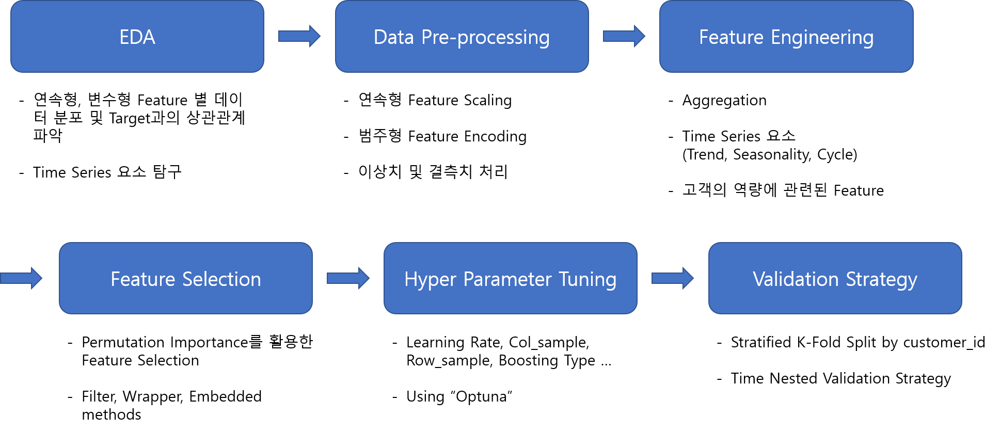

# Project: Oneline Retail Prediction

### [Click for Detail process in wrap-up report](https://www.notion.so/P-Stage2-Wrap-up-Report-836eb52655a04026a5a77986c1c0597e)

 

Predict future consumption of customers using online trading customer log data
 - Binary Classification whether the customer purchase amount for December 2011 exceeds 300: `Yes(1)`, `No(0)`

 

**Model Structure**
> Using 3 Machine Learning Models & 1 Deep Learning Model for binary classification
 - XGBoost
 - LightGBM
 - CatBoost
 - TabNet

  

## Task Description
Structured data is the basis for data analysis. Structured data analysis enables you to conduct EDA, preprocessing exercises, and learn the overall capabilities of data analysis through machine learning modeling.

Recently, the number of customers using online transactions is increasing, so the log data of customers is increasing. We are planning to conduct a project to predict and analyze customers' future consumption using previous online customer log data.

When we checked the total monthly purchase price of our customers, it was confirmed that consumption was taking place at the end of the year. Therefore, we are planning to make a model for successful marketing through promotion to customers in December. Online transaction log data are given from December 2009 to November 2011. By November 2011, we need to predict whether the customer purchase amount for December 2011 exceeds 300 using the data.

 

## Dataset Description

One data is generated when customers purchase, and the data is given as a learning dataset from December 2009 to November 2011 with the following features:
 - Information about the customer (customer_id / country)
 - Product Information (product_id / description / price)
 - Transaction Information (order_id / order_date / quantity)

 

## Feature Processing

### Feature Engineering
- **Aggregation with Time Series**: Create features by dividing periods so that models can learn trends & cycles not just considering information about all months at once.
  - feature: price, quantity, total, unique order_id
  - aggregation: 'max', 'min', 'sum', 'mean', 'count', 'std', 'skew', mean_ewm, last_ewm, avg_diff

- **Customer purchasing capabilities**
  - Number of months spending $300 or more
  - Number of months the customer has used the online shopping mall
  - Percentage of monthly expenses of $300 or more during the shopping mall period
  - Average of total over time the customer has used the online shopping mall

- **Feature Selection with Permutation Importance**

 

## Source Code Description
 - `preprocess.py`: feature engineering with train dataset
 - `Catboost_train.py`: using Catboost model for training
 - `LightGBM_train.py`: using LightGBM model for training
 - `XGBoost_train.py`: using XGBoost model for training
 - `TabNet.ipynb`: using TabNet model for training
 - `Ensemble.ipynb`: make ensemble reusult 
 - `PyCaret.ipynd`: using pycaret for selecting model which fits best for our task
 - `utils.py`: config.json parser, logging scores
 - `paramter_tuning_optuna.ipynb`: hyper parameter tuning by bayesian optimization using optuna

 

## Result
Final Leader Board
 - 10th / 100
 - AUC: 0.8627

